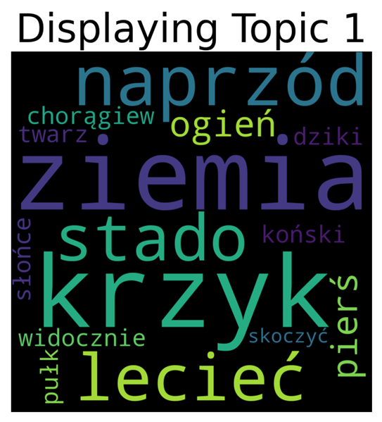
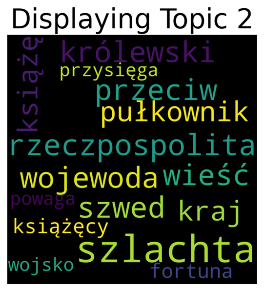
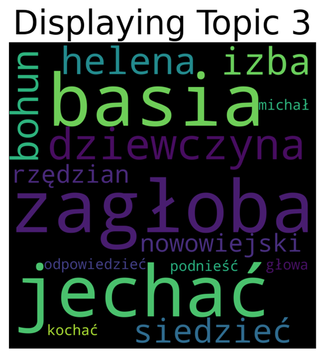
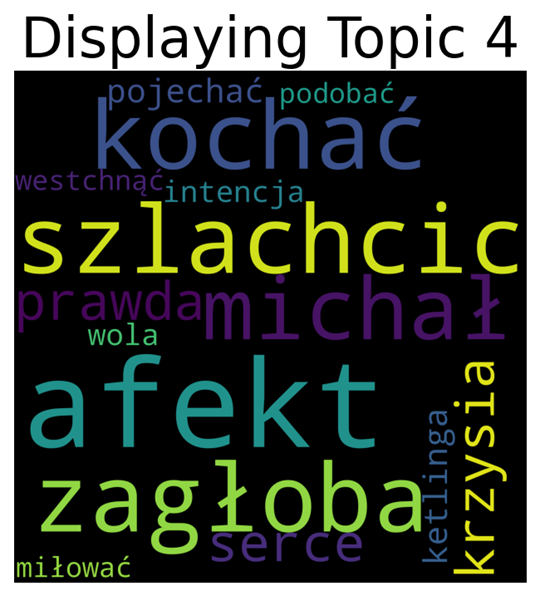
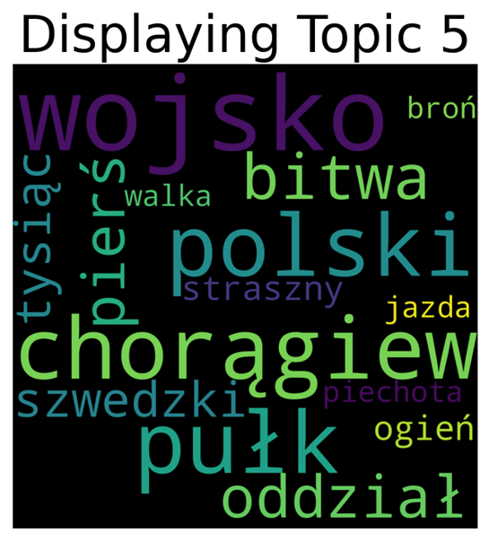
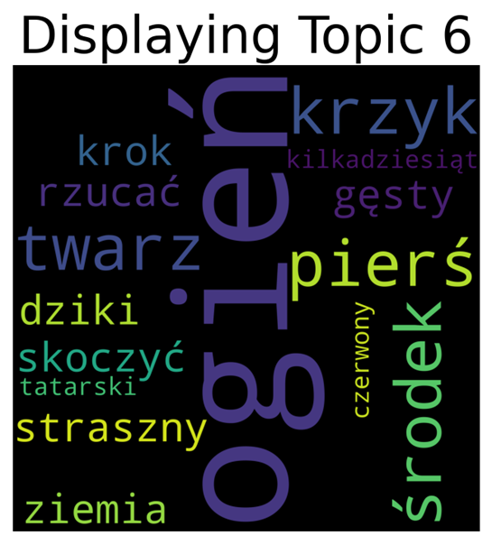
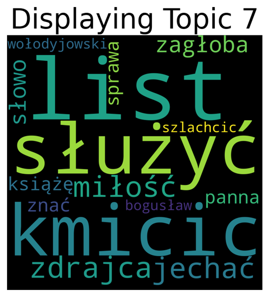
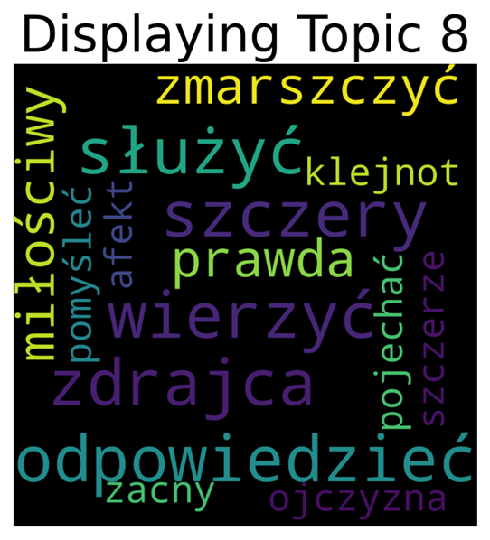

# Topic modeling of "The Trilogy" by Henryk Sienkiewicz

### Goal of the project

Conduct a topic analysis of a language corpus consisting of "The Trilogy" 
by Henryk Sienkiewicz
  

### Anticipated results

Set of topics (of a chosen size) present in the corpus, each of them
represented as a list of most frequent words inside of it. The project is
created under the assumption that final topics should be coherent and it
should be possible to assign a cohesive thought to each of them 
(such as "war", "marriage" or "childhood"). Those thoughts need to be assigned
by a person responsible for analysing the obtained word lists, because the 
model used in this project, even though it uses contextualized embeds does not
"understand" the ideas behind specific utterances.

Although the primary task of this exercise is to perform topic modeling on the
specified set of texts, it is worth mentioning, that as an additional result 
of the training we will obtain a classifier, which can assign topics extracted 
from the original corpora to new texts, which the model had not "seen" before.
  

### Course of project implementation

I have decided to use Jupyter Notebook in the Google Colab environment.
For the corpus I have selected "The Trilogy" by Henryk Sienkiewicz, because it
was a sufficiently large, publicly available set of text data. Aiming to 
maximize the accuracy of sought connections between words, I have decided to 
lemmatize (reduce words to their dictionary form) all of them, so the model 
wouldn't treat words like "battle" and "battles" as two unconnected phrases. 
To achieve such effect, I have used the "Postagger" tool made available by 
the CLARIN project, which for every given word returned its lemma. The module 
I decided to use for the extraction of topics (CombinedTM) from such 
preprocessed corpus relied on a pretrained polish embedding model Polbert 
(BERT for polish language) and was able to return the proximity of words not 
only based on their visual similarity (e.g. "king", "kingdom"), but also their
contextual meaning (e.g. "dad", "father"). Due to the limitations of the model
I have decided to join together the original set of 6 books (3 titles 
consisting of 2 toms each), and then divide it into lines of 512 words each.
That choice was arbitrary, made as a result of multiple tests due to yielding 
the best effects (one line is one contextualized embedding). On such 
preprocessed corpus I have trained the CTM model, repeatedly modifying 
parameters and sieving out unsatisfactory results, for example by changing the
number of topics to find or expanding the list of stopwords (words that appear 
frequently, but do not carry any information relevant to the context - for
example "but", "and", "very"). I have shown the final result in the form of 
wordclouds.
  

### Results

For every topic I have selected its 15 most frequently occurring words for 
representation. The numbers of occurrences of those words normalised in 
relation to the number of words assigned to each topic (so they can be 
interpreted as the probability of choosing given word when selecting a word 
from given topic at random) have then been used to create the wordclouds. In 
each wordcloud the size of every word is proportional to its computed 
probability. 

  

### Analysis of the obtained results

On the presented visualisations a lot of motives can be found, that in fact 
appear in The Trilogy. Topics 1, 5 and 6 contain a lot of words which in the 
Polish language reminiscent of battle, turmoil or fight. On the other hand, in 
topics 3 and 4 one can find a romantic theme, as they contain a lot of names, 
surnames and words like "love" or "heart". Basing on the knowledge of the 
studied reading it can be noted, that characters visible in shown 
visualisations of those topics actually had feeling for each other. In the 
wordcloud number 2 words related to the politics of the old Republic of Poland 
can be found. Topic 8 is harder to decipher, though I assume it contains words
related to patriotism, honour or serving the country, which are all values very
important for the heroes of the analysed trilogy. The remaining visualisation, 
marked with the number 7 is ambiguous to me. It can be assigned both to the 
topic group (3, 4) and (8). It shows words connected to serving, lists and 
betrayal, however without a wider context it is hard to determine whether those
phrases refer to another person or the country.
  

### Conclusions

Looking at the results of conducted analysis a conclusion can be drawn, that it
was effective - obtained topics are cohesive, coherent and convey thoughts, 
that are actually dominant in the analysed corpus. Methods used do achieve the
final effect of this project can be therefore used to perform topic analysis on
other texts.  
As for The Trilogy itself, it can be noted, that its main themes are fight,
patriotism and love. Those motives were consistent across both small number 
(<4) and a larger number (>18) of topics, but increasing the number of sought 
topics did not result in new themes being found, only increased the size of the
thematic subgroups (e.g. 9 themes could be subsumed into the "fight" group 
instead of 3).
